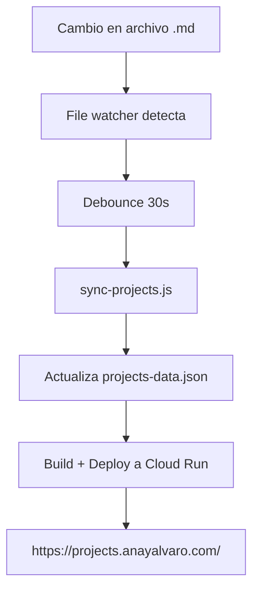

# 🚀 Dashboard Dinámico de Proyectos

Tu dashboard de proyectos completamente automático en **https://projects.anayalvaro.com/**

## ✨ Qué es Dinámico

- **📝 Auto-detección:** Cambios en archivos .md → actualización automática
- **⚡ Deploy automático:** Sin intervención manual
- **🔄 Sincronización:** Datos siempre actualizados desde tus archivos
- **👀 Monitoreo continuo:** File watcher observa cambios

## 🎯 Archivos Monitoreados

El dashboard lee automáticamente desde:

- `PROJECTS.md` - Proyectos principales
- `NEW_PROJECTS.md` - Proyectos nuevos
- `MEMORY.md` - Estado de proyectos en memoria
- `PROJECT_STATUS.md` - Métricas detalladas
- `memory/*.md` - Logs diarios
- `*/README.md` - READMEs de proyectos

## 🚀 Cómo Usar

### Opción 1: Launch Rápido
```bash
cd ~/.openclaw/workspace/projects-dashboard
./start-dynamic-dashboard.sh
```

### Opción 2: Comandos Individuales
```bash
# Solo sincronizar datos
npm run sync

# Desplegar una vez
npm run deploy

# Iniciar watcher automático
npm run watch
```

## 🎛️ Modos de Operación

### 1. 👀 Watcher Dinámico (Recomendado)
- Observa cambios en tiempo real
- Deploy automático cada 30 segundos después del último cambio
- Usa: `npm run watch`

### 2. 🚀 Deploy Manual
- Sincroniza + despliega inmediatamente
- Usa: `npm run deploy`

### 3. 📊 Solo Sync
- Actualiza datos sin desplegar
- Usa: `npm run sync`

### 4. 🛠️ Desarrollo Local
- Servidor local en localhost:3000
- Usa: `npm run dev`

## 📊 Flujo de Actualización



## 🔧 Arquitectura Técnica

- **Frontend:** Next.js con Tailwind CSS
- **Datos:** JSON dinámico desde archivos MD
- **Deploy:** Google Cloud Run (sub-30s)
- **Monitoring:** File watcher con chokidar
- **Domain:** Cloudflare DNS → projects.anayalvaro.com

## 📈 Estados de Proyecto Detectados

El script auto-detecta estados basado en keywords:

- **🟢 Active:** "funcionando", "production", "activo"
- **🟡 Progress:** "desarrollo", "progreso", "MVP"  
- **🔵 Research:** "investigación", "análisis", "research"
- **✅ Completed:** "completado", "done", "finalizado"

## ⚡ Velocidad de Deploy

- **Detección:** Inmediata
- **Debounce:** 30 segundos
- **Build:** ~15 segundos
- **Deploy:** ~20 segundos
- **Total:** <1 minuto desde cambio

## 🐛 Troubleshooting

### Error: "gcloud not found"
```bash
# Instalar gcloud CLI
curl https://sdk.cloud.google.com | bash
exec -l $SHELL
gcloud init
```

### Build falla
```bash
cd projects-dashboard
npm install
npm run build
```

### Watcher no responde
```bash
# Matar procesos zombie
pkill -f "watch-and-deploy"
npm run watch
```

## 📱 Acceso Móvil

El dashboard es completamente responsive:
- **Desktop:** Vista completa con filtros
- **Mobile:** Cards optimizadas 
- **Tablet:** Grid adaptativo

## 🔐 Seguridad

- **Deploy:** Solo desde tu máquina local
- **Auth:** Sin autenticación (público)
- **Datos:** Solo metadata de proyectos
- **SSL:** HTTPS automático vía Cloud Run

## 📊 Logs y Monitoreo

### Ver logs del watcher
```bash
# En terminal separada
tail -f ~/.openclaw/workspace/projects-dashboard/logs/watcher.log
```

### Health check
```bash
curl -I https://projects.anayalvaro.com/
# Debe retornar HTTP 200
```

## 🎯 URLs Importantes

- **Dashboard:** https://projects.anayalvaro.com/
- **Repo:** `/home/alvaro/.openclaw/workspace/projects-dashboard/`
- **Datos:** `data/projects-data.json`
- **Scripts:** `scripts/`

---

## 🚀 Quick Start

```bash
cd ~/.openclaw/workspace/projects-dashboard
./start-dynamic-dashboard.sh
# → Selecciona opción 2 (Watcher Dinámico)
```

Ahora cada vez que modifiques un proyecto en tus archivos .md, el dashboard se actualizará automáticamente en ~1 minuto.

**¡Tu dashboard está vivo! 🎉**